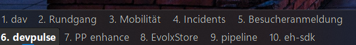

<p align="center">
  
</p>

<h1 align="center">DesktopNames</h1>

<p align="center">
  <em>Your virtual desktop names, right on the Windows 11 taskbar.</em>
</p>



DesktopNames puts all your named virtual desktops directly on the taskbar as clickable buttons. Click one to **switch instantly** — no Win11 scroll animation, no Task View, no waiting.

Windows 11 only ships `Win+Ctrl+Left/Right` to scroll one desktop at a time — and has no built-in hotkey to jump to a specific desktop or move a window to one. DesktopNames fills that gap itself — no AutoHotkey needed:

- **`Win+1..0`** — jump directly to desktops 1 through 10; **`Win+Shift+1..0`** for 11 through 20.
- **`Win+Ctrl+1..0`** — move the focused window to desktop 1 through 10; **`Win+Ctrl+Shift+1..0`** for 11 through 20.

Every binding is in `settings.json` under `Hotkeys`. Hotkeys go through a low-level keyboard hook, so they win over chords Windows reserves for itself.

## Features

- **Taskbar overlay** - Desktop names appear right on the taskbar, not hidden in the system tray
- **Multi-monitor** - Overlay appears on the correct edge of every connected monitor's taskbar (top or bottom), derived from the monitor work area so it never lands on the wrong edge
- **Compact two-row layout** - Buttons are half the taskbar height and wrap into two rows, keeping the block tight and flush-left
- **Click to switch** - Click any desktop name to switch to it instantly
- **Live updates** - Automatically reflects desktop creation, removal, renaming, and switching; repositions if you move the taskbar to a different edge
- **Win11 styled** - Matches your taskbar's dark/light theme with Segoe UI Variable font, rounded corners, and accent-colored active indicator
- **Non-intrusive** - Doesn't steal focus, hidden from Alt+Tab

## Requirements

- Windows 11
- [.NET 8 Runtime](https://dotnet.microsoft.com/download/dotnet/8.0) (or SDK to build from source)

## Running

Download the latest release from the [Releases page](https://github.com/davwright/DesktopNames/releases), unzip, and run `DesktopNames.exe`.

Or from source:

```
cd DesktopNames
dotnet run
```

Or publish and run the executable directly:

```
dotnet publish .\DesktopNames\DesktopNames.csproj -c Release -o publish
.\publish\DesktopNames.exe
```

## Auto-start on login

To have DesktopNames start automatically when you sign in:

1. Press `Win+R`, type `shell:startup`, press Enter. This opens your user's Startup folder.
2. Right-click in the folder → **New → Shortcut**.
3. For the location, browse to your `DesktopNames.exe` (e.g., the `release\` folder from this repo, or wherever you unzipped the release).
4. Name the shortcut `DesktopNames` and finish.

It will now launch silently at each login. There is no window — it only draws on the taskbar, with a system tray icon for exit.

## Exiting

Right-click the system tray icon and select **Exit**.

## How it works

The app uses undocumented Windows COM interfaces (`IVirtualDesktopManagerInternal`) to enumerate desktops, read their names, and switch between them. If the COM interfaces aren't available (GUIDs change between Windows builds), it falls back to reading desktop info from the registry and switching via keyboard simulation (Ctrl+Win+Arrow).

The overlay is a borderless, topmost WinForms window positioned over each taskbar using `Shell_TrayWnd` / `Shell_SecondaryTrayWnd` window detection.

## Troubleshooting

| Issue | Cause | Fix |
|-------|-------|-----|
| Shows "Desktop 1, Desktop 2..." instead of custom names | COM interface GUIDs don't match your Windows build | The app falls back to registry; names should still appear if you've set them in Task View |
| Clicking doesn't switch desktops | COM switch failed, keyboard fallback may be slow | Ensure no other app is intercepting Ctrl+Win+Arrow |
| Overlay not visible | Taskbar detection failed or overlay is behind taskbar | Try restarting the app; check if your taskbar is in an unusual configuration |

## License

[MIT](LICENSE).
